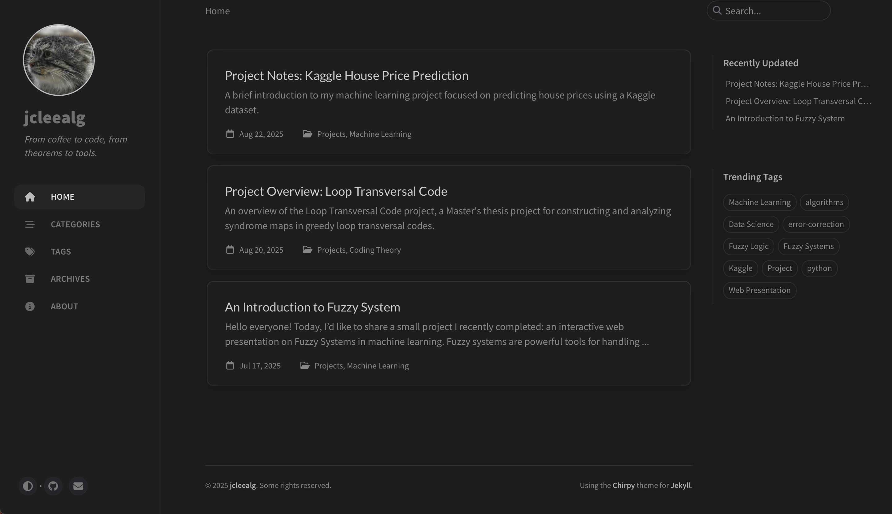

# My Personal Website (jcleealg.github.io)

> This repository contains the source code for my personal website, which is live at **[https://jcleealg.github.io](https://jcleealg.github.io)**.

This site serves as my personal blog and project portfolio where I write about machine learning, software development, and other technical topics.

---

## Credits & License

This site is built using the [Chirpy Jekyll theme](https://github.com/cotes2020/jekyll-theme-chirpy/). The underlying source code is licensed under the [MIT License](./LICENSE).